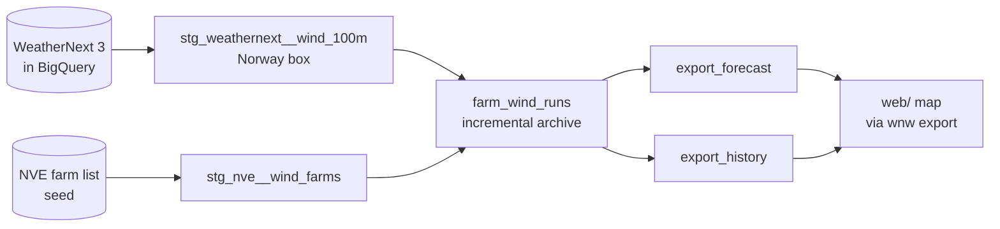

# weathernext-norway-wind

A map of Norway's wind farms with WeatherNext 3 wind at 100 metres, roughly turbine hub height, on one timeline. Drag left to see the past five days as the model saw them. Drag right to see the forecast for the next three days.

Each farm is a dot sized by installed capacity. The colour shows expected output from the median forecast. The halo around it grows when the 64 ensemble members disagree, so a small halo means the forecasts agree and a large one means nobody knows yet. Click a farm to see its P10 to P90 band over the whole timeline, with a line at now. Point at that chart for each hour's values, and click it to show that hour on the map. Times are in your own time zone.

This is an example project. It uses a generic power curve, not each turbine's real one.

## How it works

1. `wnw farms` downloads the 61 operating wind farms from NVE, with location, capacity and hub height, and writes `web/data/farms.geojson`. It also writes the same list as `dbt/seeds/nve_wind_farms.csv` for the dbt route.
2. `wnw forecast` sends those points to BigQuery. One query joins each farm to the WeatherNext grid cell it sits in and returns P10, P50 and P90 of `wind_speed_100m` for the next 72 hours. It uses the newest run from 00, 06, 12 or 18 UTC, since the hourly runs in between stop at 48 hours. The result is written to `web/data/forecast.json`.
3. `wnw history` does the same for the past five days. For each past hour it takes the +1 hour step of the run that started an hour earlier, which is the model's closest view of what the wind was. The result is written to `web/data/history.json`. These are model values, not measurements.
4. `web/` is a static page that reads the files and joins history and forecast into one timeline. No backend.

Both commands also keep a timestamped copy of every run. The queries are in [`src/weathernext_norway_wind/sql/`](src/weathernext_norway_wind/sql/).

## Setup

You need [uv](https://docs.astral.sh/uv/), the gcloud CLI and a Google Cloud project with billing.

1. **Request access.** WeatherNext on BigQuery is allowlisted. Request it with the [WeatherNext data request form](https://docs.google.com/forms/d/e/1FAIpQLSeCf1JY8G78UDWzbm0ly9kJxfSjUIJT5WyMR_HiNqCm-IHIBg/viewform). Google says approval typically takes 5 to 7 business days.
2. **Add the dataset to your project.** Once approved, open the [WeatherNext 3 listing](https://console.cloud.google.com/bigquery/analytics-hub/discovery/projects/gcp-public-data-weathernext/locations/us/dataExchanges/weathernext_19397e1bcb7/listings/weathernext_3_1a067c1e929) and click Add dataset to project. Pick your project and a dataset name, for example `weathernext_3`. This creates a read-only linked dataset in the US location, and your table is `<project>.weathernext_3.weathernext_3_0_0_0p1deg`. Google charges nothing for the data itself at the moment. You pay BigQuery for the bytes your queries read.
3. **Cap the daily cost.** By default a project may read 200 TiB a day. In the console, under IAM & Admin and then Quotas & System Limits, set the BigQuery API quota "Query usage per day" (not the one per user) to 1 TiB, entered as `1048576` MiB. That caps on-demand spend at about 6 USD a day. BigQuery checks the quota against its estimate before a query runs, and the estimates here are far above what the queries read, so don't set it much lower.
4. **Configure and log in.**

```sh
uv sync
cp .env.example .env                    # set WEATHERNEXT_TABLE and GOOGLE_CLOUD_PROJECT
gcloud auth application-default login   # with the account that has access
```

## Run

```sh
set -a; source .env; set +a

uv run wnw farms
uv run wnw forecast --dry-run
uv run wnw forecast

python3 -m http.server -d web 8000
```

Then open http://localhost:8000. Run the commands from the repository root, since they read and write `web/data/`.

`wnw forecast` uses the newest 00, 06, 12 or 18 UTC run, since the hourly runs in between stop at 48 hours. A new one arrives every six hours, usually about seven hours after it starts. Pass `--init-time` to use an earlier run. `wnw update` runs `wnw history` and `wnw forecast` from the same run, which the map shows as now; run on their own, give them the same time (`--until` and `--init-time`) or the timeline can have a gap.

### Estimate versus bill

BigQuery gives two numbers for a query. The estimate comes before it runs, from a dry run such as `wnw forecast --dry-run`, and bills nothing. The bill is what the query actually read, and that is what you pay.

| Query, October 2026 | Google's estimate | Billed |
|---|---|---|
| `wnw forecast` on one hourly 48-hour run | 285 GB | 0.23 GB |
| dbt first build | 949 GB | 5.4 GB |
| dbt build adding 12 runs | about 650 GB | 4.9 GB |

The bill is under 1% of the estimate. The queries filter on a box around Norway, and the WeatherNext table is clustered by geography, so while a query runs BigQuery skips the stored blocks outside the box. The estimate can't see that in advance, and for these queries it counts the whole globe for every UTC day the query touches. [Google's documentation](https://docs.cloud.google.com/bigquery/docs/best-practices-costs) says that for clustered tables the estimate is an upper bound. `wnw forecast` and `wnw history` print the billed bytes, and the BigQuery console shows them for every job.

Every query is capped at `WNW_MAX_GB` (1000 GB by default). BigQuery checks the cap against its estimate, not against what the query reads, so a query estimated over the cap fails without being charged. `wnw history` and `wnw update` (history plus forecast) read many runs and are estimated at several TB, so the default cap stops them on purpose. The dbt route below builds the same history for a fraction of that. To run them anyway, raise both `WNW_MAX_GB` and the project's daily quota above the estimate for that one run.

## A dbt pipeline

The [`dbt/`](dbt/) folder builds the same `forecast.json` and `history.json` as a dbt project on BigQuery, so WeatherNext becomes one more source in an ordinary data pipeline. The map doesn't change.



[`docs/dbt-lineage.png`](docs/dbt-lineage.png) shows the same flow, with the SQL tests, as dbt's own lineage graph from `dbt docs`.

| Pattern | How it shows up here |
|---|---|
| Source freshness | `dbt source freshness` warns when the newest run is 10 hours old and fails at 24. WeatherNext publishes about seven hours late. |
| Staging | `stg_weathernext__wind_100m` flattens the forecast array and keeps the Norway box. It is ephemeral, so nobody can query it without a run filter. |
| Incremental load with late data | `farm_wind_runs` lists the runs WeatherNext has and reads only those the archive lacks, so late and out-of-order runs are picked up. |
| Idempotent merge | Rows merge on farm, run and lead hour, so running a build again never duplicates anything. |
| Partitioning and clustering | The archive is partitioned by run day and clustered by farm. Filters use constant bounds so BigQuery can skip what it doesn't need. |
| Tests | One row per farm, run and lead hour, P10 ≤ P50 ≤ P90, and every farm in the archive exists in the farm list (a warning). Column tests are in `dbt/models/schema.yml`, SQL tests in `dbt/tests/`. |
| Data contracts | `export_forecast` and `export_history` have the exact shape of the map's JSON files. The contracts are enforced, so a change that would break the map fails the build. |
| Cost guard | A daily query quota caps spend. BigQuery checks it against estimates far above the bill, so each build reads one UTC day. |
| Serving | `wnw export` copies the export tables into `web/data/` with no logic. Reading a table directly isn't billed as a query. |

```sh
uv sync --group dbt
set -a; source .env; set +a

uv run wnw farms
uv run dbt source freshness --project-dir dbt --profiles-dir dbt \
  && uv run dbt build --project-dir dbt --profiles-dir dbt \
  && uv run wnw export
```

Keep the `&&`. When a test fails, `dbt build` skips everything that depends on it and exits with an error, and the `&&` stops `wnw export`, so the map keeps its last good data. Without it the export would copy stale tables without complaint. Run the chained command every hour: the archive gets every run, and the map moves on with each 00, 06, 12 or 18 UTC run. Measured in October 2026, adding a run costs about 0.4 GB, the 72-hour runs included, and a round that finds nothing new costs about 0.4 GB with the freshness check. An hourly round adds about one run, so it costs about 0.8 GB, roughly 20 GB a day.

The first build loads the past day (`backfill_days`), one UTC day per build, so with the default of one day the second build adds the rest. Run late in the UTC day, the first build may get only 48-hour runs. The export then finds no 72-hour run, `wnw export` stops with an error, and the map gets its data from the second build. The history on the map grows to the full five days over the following days. Check what a build costs before running it: `uv run dbt compile --project-dir dbt --profiles-dir dbt`, then paste `dbt/target/compiled/weathernext_norway_wind/models/archive/farm_wind_runs.sql` into the BigQuery console, which shows the bytes it would read. Like the dry run above, that figure is an upper bound. `dbt compile` itself runs the run lookups described below, about 0.1 GB.

Every build first lists the runs WeatherNext has from the last `backfill_days`, which the Norway box keeps to about 0.1 GB, and reads only the runs the archive doesn't have yet, one UTC day per build, oldest first. Runs that arrive late or out of order are picked up that way, and none is read twice. BigQuery estimates every UTC day a query touches as a whole, about 650 GB, and the daily quota is checked against that estimate, so reading one day at a time keeps a 1 TiB quota workable. If the hourly job stops, the next builds catch up by themselves, one UTC day each, but never further back than `backfill_days`. After a long pause the archive keeps a gap, which drops out of the map's five days within about five days. Until then the slider skips the gap without a mark. To fill in missing runs from the last N days instead, run builds with `--vars '{backfill_days: N}'` until nothing is missing; each adds one UTC day. `backfill_days` is a variable in `dbt/dbt_project.yml`. The archive's tests check the last day of rows, so the cost of each build stays flat as the archive grows. `DBT_LOCATION` must match the location of your WeatherNext dataset.

To see the models and how they depend on each other as a graph, run `uv run dbt docs generate --no-compile --project-dir dbt --profiles-dir dbt` (without `--no-compile` it runs the billed lookups too), then `uv run dbt docs serve --project-dir dbt --profiles-dir dbt`.

### Scheduled builds

[`.github/workflows/dbt-build.yml`](.github/workflows/dbt-build.yml) runs `dbt source freshness` and `dbt build` every six hours, and by hand from the Actions tab. It only builds the archive in BigQuery, so no forecast ends up on GitHub, only the log. It does nothing until the repository variable `WEATHERNEXT_TABLE` is set, so a copy of this repository stays quiet. Four builds a day read about 11 GB.

Switching it on takes three steps.

1. In Google Cloud, create a service account with BigQuery User on the project and BigQuery Data Viewer on the WeatherNext dataset. If the dbt dataset already exists, give it BigQuery Data Editor there too.
2. Let GitHub sign in as that service account without a key, through Workload Identity Federation limited to your repository. The [`google-github-actions/auth`](https://github.com/google-github-actions/auth#indirect-wif) README has the commands, under Workload Identity Federation through a Service Account.
3. In the repository settings, under Secrets and variables and then Actions, add the variables `WEATHERNEXT_TABLE`, `GOOGLE_CLOUD_PROJECT`, `GCP_WORKLOAD_IDENTITY_PROVIDER` and `GCP_SERVICE_ACCOUNT`, plus `DBT_DATASET` and `DBT_LOCATION` if yours differ from `weathernext_norway_wind` and `US`.

GitHub emails the person who last changed the schedule when a run fails. In a public repository, GitHub disables scheduled workflows after 60 days without commits, and the scheduled runs don't count. Turn it back on from the Actions tab.

## Development

```sh
uv run pytest
uv run ruff check .
uv run ruff format .
```

## Caveats

- The forecast is for a roughly 10 km grid cell, not for the turbine. Most Norwegian wind farms sit on ridges and coastal hills that a cell that size cannot resolve.
- Hub heights in Norway range from 31 to 145 metres. The forecast is at 100 metres.
- Expected output is a rough indicator, mainly for comparing hours at the same farm. The grid cell's error differs from farm to farm, so comparisons between farms are weaker. It has not been checked against real production.
- Expected output comes from the median wind only. The power curve drops to zero above cut-out speed, so running P10 and P90 through it would not give output percentiles.
- Offshore wind at oil and gas installations, such as Hywind Tampen, is not in NVE's dataset.
- Runs usually appear in BigQuery about seven hours after they start. One has been seen arriving about an hour later, after a newer run, and the dbt route picks such a run up on the next build. The map's now is the newest 00, 06, 12 or 18 UTC run, so now on the map is usually seven to thirteen hours behind the clock.

## Data and licences

- Wind farm data is from the Norwegian Water Resources and Energy Directorate (NVE), under the [Norwegian Licence for Open Government Data (NLOD)](https://data.norge.no/nlod/en/2.0).
- WeatherNext data about a time more than one hour ago is licensed under CC BY 4.0. Data about the last hour and the future falls under Google DeepMind's [Real-Time Weather Forecasting Experimental Data Terms](https://storage.googleapis.com/weathernext-public/terms-of-use.pdf). They allow internal use. A map or file from which the forecast values can be read may only be shared with known recipients, not published, and published findings need the notice the terms give. For that reason `web/data/forecast*.json` is git-ignored. `web/data/history*.json` is about times at least seven hours ago, so it is CC BY 4.0, but as generated data it is git-ignored too.
- Map tiles are from OpenStreetMap.
- The code in this repository is under the [MIT licence](LICENSE).
