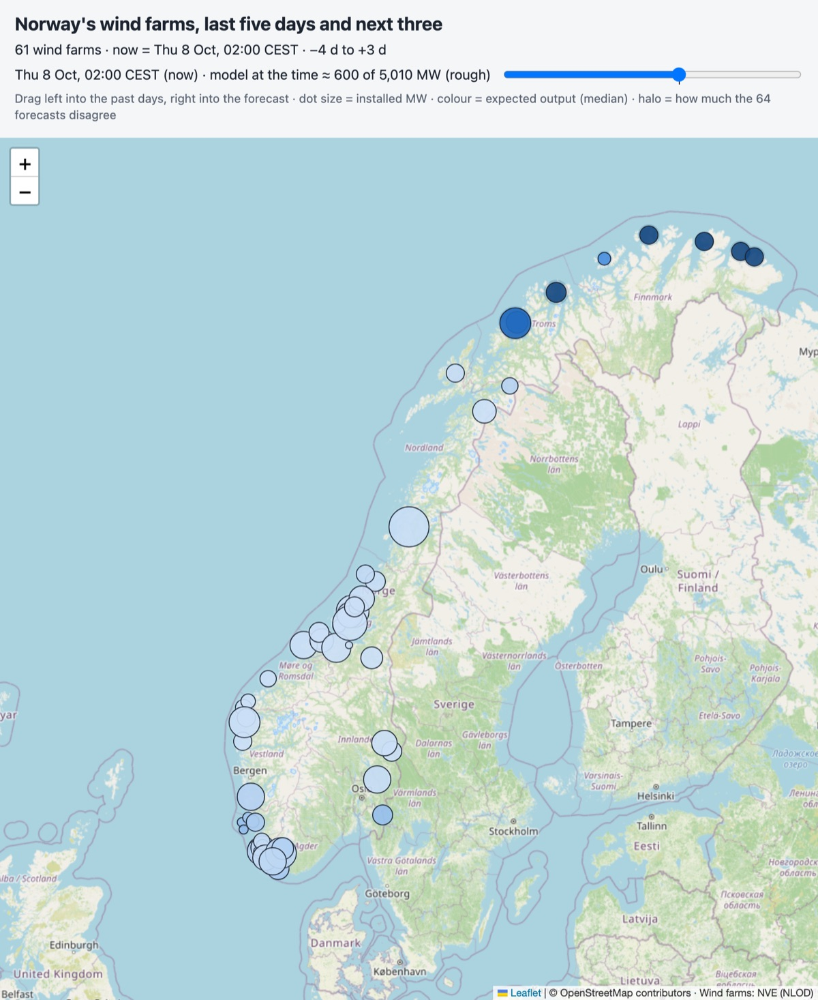
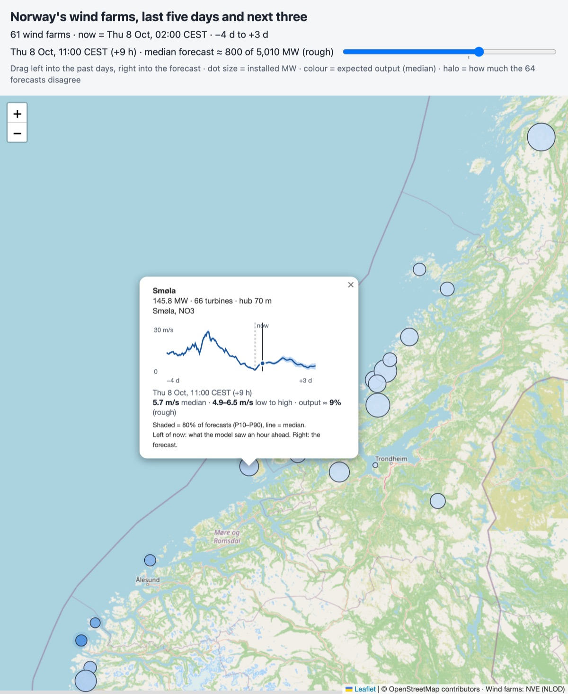
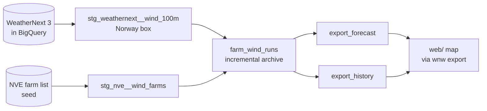

# weathernext-norway-wind

WeatherNext 3, Google DeepMind's AI weather model, is published as tables in BigQuery. This repository treats it as one more source in an ordinary data pipeline. A dbt project keeps an archive of the 100 metre wind at Norway's 61 operating wind farms, and a small map shows the past five days and the next three.

The map is the example at the end of the pipeline. Each farm is a dot sized by installed capacity and coloured by expected output from the median forecast, with a halo that grows when the 64 ensemble members disagree. Drag the slider to move through time. Click a farm for its P10 to P90 band, point at the chart for each hour's values, and click it to show that hour on the map. Expected output uses a generic power curve, not each turbine's real one.

<p>
  
  
</p>

<sub>Wind from WeatherNext 3 by Google DeepMind (CC BY 4.0), map © OpenStreetMap contributors, wind farms from NVE (NLOD). Screenshots from 8 October 2026.</sub>

## Setup

You need [uv](https://docs.astral.sh/uv/), the gcloud CLI and a Google Cloud project with billing.

1. **Request access.** WeatherNext on BigQuery is allowlisted. Request it with the [WeatherNext data request form](https://docs.google.com/forms/d/e/1FAIpQLSeCf1JY8G78UDWzbm0ly9kJxfSjUIJT5WyMR_HiNqCm-IHIBg/viewform). Google says approval typically takes 5 to 7 business days.
2. **Add the dataset to your project.** Open the [WeatherNext 3 listing](https://console.cloud.google.com/bigquery/analytics-hub/discovery/projects/gcp-public-data-weathernext/locations/us/dataExchanges/weathernext_19397e1bcb7/listings/weathernext_3_1a067c1e929) and click Add dataset to project, with a dataset name such as `weathernext_3`. This creates a read-only linked dataset in the US location. Your table is `<project>.weathernext_3.weathernext_3_0_0_0p1deg`.
3. **Cap the daily cost.** Under IAM & Admin and then Quotas & System Limits, set the BigQuery API quota "Query usage per day" (not the one per user) to 1 TiB, entered as `1048576` MiB. The default is 200 TiB. See [What it costs](#what-it-costs) for why not lower.
4. **Configure and log in.**

```sh
uv sync --group dbt
cp .env.example .env                    # set WEATHERNEXT_TABLE and GOOGLE_CLOUD_PROJECT
gcloud auth application-default login   # with the account that has access
```

## The pipeline



[`docs/dbt-lineage.png`](docs/dbt-lineage.png) shows the same flow, with the SQL tests, as dbt's own lineage graph.

| Pattern | How it shows up here |
|---|---|
| Source freshness | `dbt source freshness` warns when the newest run is 10 hours old and fails at 24. WeatherNext publishes about seven hours late. |
| Staging | `stg_weathernext__wind_100m` flattens the forecast array and keeps the Norway box. It is ephemeral, so nobody can query it without a run filter. |
| Incremental load with late data | `farm_wind_runs` lists the runs WeatherNext has and reads only those the archive lacks, so late and out-of-order runs are picked up. |
| Idempotent merge | Rows merge on farm, run and lead hour, so running a build again never duplicates anything. |
| Partitioning and clustering | The archive is partitioned by run day and clustered by farm. Filters use constant bounds so BigQuery can skip what it doesn't need. |
| Tests | One row per farm, run and lead hour, P10 ≤ P50 ≤ P90, and every farm in the archive exists in the farm list (a warning). |
| Data contracts | `export_forecast` and `export_history` have the shape of the map's JSON files. The contracts are enforced, so a change that would break the map fails the build. |
| Cost guard | Each build reads one UTC day, because the daily quota is checked against Google's estimate. See [What it costs](#what-it-costs). |
| Serving | `wnw export` copies the export tables into `web/data/` with no logic. Reading a table directly isn't billed as a query. |

```sh
set -a; source .env; set +a

uv run dbt source freshness --project-dir dbt --profiles-dir dbt \
  && uv run dbt build --project-dir dbt --profiles-dir dbt \
  && uv run wnw export

python3 -m http.server -d web 8000      # then open http://localhost:8000
```

Keep the `&&`. If a test fails, the export doesn't run and the map keeps its last good data.

Each build looks back one day (`backfill_days` in `dbt/dbt_project.yml`) and reads the missing runs one UTC day at a time, oldest first. The first build therefore takes two rounds, and a new setup starts with about a day of history that grows to five days. Late in the UTC day the first round may get only 48-hour runs. The export tables are then empty, `wnw export` stops with an error, and the map gets its data from the second round. After a pause longer than a day the archive keeps a gap, which the map's slider skips without a mark. To fill missing runs from the last N days, run builds with `--vars '{backfill_days: N}'` until nothing is missing. `DBT_LOCATION` must match your WeatherNext dataset's location, and `uv run wnw farms` refreshes the committed farm list from NVE.

`uv run dbt docs generate --no-compile --project-dir dbt --profiles-dir dbt` and then `uv run dbt docs serve --project-dir dbt --profiles-dir dbt` show the models and tests as a graph. Without `--no-compile`, generating the docs runs the billed run lookups.

### Scheduled builds

[`.github/workflows/dbt-build.yml`](.github/workflows/dbt-build.yml) runs `dbt source freshness` and `dbt build` every six hours, and by hand from the Actions tab. It only builds the archive in BigQuery, so no forecast ends up on GitHub, only the log. It does nothing until the repository variable `WEATHERNEXT_TABLE` is set, so a copy of this repository stays quiet.

1. In Google Cloud, create a service account with BigQuery User on the project and BigQuery Data Viewer on the WeatherNext dataset. If the dbt dataset already exists, give it BigQuery Data Editor there too.
2. Let GitHub sign in as that service account without a key, through Workload Identity Federation limited to your repository. The [`google-github-actions/auth`](https://github.com/google-github-actions/auth#indirect-wif) README has the commands, under Workload Identity Federation through a Service Account.
3. In the repository settings, under Secrets and variables and then Actions, add the variables `WEATHERNEXT_TABLE`, `GOOGLE_CLOUD_PROJECT`, `GCP_WORKLOAD_IDENTITY_PROVIDER` and `GCP_SERVICE_ACCOUNT`, plus `DBT_DATASET` and `DBT_LOCATION` if yours differ from `weathernext_norway_wind` and `US`.

GitHub emails the person who last changed the schedule when a run fails. In a public repository, GitHub disables scheduled workflows after 60 days without commits, and the scheduled runs don't count. Turn it back on from the Actions tab.

## Using the data in a BI tool

Looker Studio, Power BI and most other BI tools have a BigQuery connector, so they can read the pipeline's tables directly. Point them at `farm_wind_runs` in the dbt dataset (`weathernext_norway_wind` unless you set `DBT_DATASET` in `.env`), which holds every run and farm for lead hours 1 to 72, and join `nve_wind_farms` on `farm_id` = `id` for names and capacity. Filter on `lead_hours = 1` for the model's view of the past, or on one `init_time` for a single forecast. The archive is partitioned by `init_time`. If the tool offers to use the partition column as its date range, take it, so a chart only reads the days it shows.

Don't point a BI tool at the WeatherNext table itself, since one chart there can be estimated at terabytes. Each chart refresh is a query, billed at least 10 MB per table. A dashboard that shows forecast values may only be shared with known people, under the terms in [Data and licences](#data-and-licences).

## What it costs

Google charges nothing for the WeatherNext data itself at the moment. You pay BigQuery for the bytes your queries read, and the first TiB each month is free.

### Estimate versus bill

BigQuery gives two numbers for a query. The estimate comes before it runs, from a dry run, and bills nothing. The bill is what the query actually read, and that is what you pay.

| Query, October 2026 | Google's estimate | Billed |
|---|---|---|
| `wnw forecast` on one hourly 48-hour run | 285 GB | 0.23 GB |
| dbt first build | 949 GB | 5.4 GB |
| dbt build adding 12 runs | about 650 GB | 4.9 GB |

The bill is under 1% of the estimate. The queries filter on a box around Norway, and the WeatherNext table is clustered by geography, so while a query runs BigQuery skips the stored blocks outside the box. The estimate can't see that in advance, and for these queries it counts the whole globe for every UTC day the query touches. [Google's documentation](https://docs.cloud.google.com/bigquery/docs/best-practices-costs) says that for clustered tables the estimate is an upper bound.

### Per build

Adding an hourly run costs about 0.1 GB. A 00, 06, 12 or 18 UTC run costs about 2 GB, because it carries 15 days of forecast and BigQuery reads all of it even though the pipeline keeps 72 hours. A round that finds nothing new costs about 0.4 GB, mostly the freshness check and the run lookup. Hourly rounds come to roughly 20 GB a day, about 600 GB a month, and rounds every six hours to about 11 GB a day, about 330 GB a month. Both stay within the free TiB.

### Guards

Both guards are checked against the estimate, not the bill. The daily quota from the setup caps the whole project. That is why each dbt build reads one UTC day, estimated at about 650 GB, and why the quota shouldn't go much below 1 TiB. `wnw` also caps each of its queries at `WNW_MAX_GB` (1000 GB by default), so `wnw history` and `wnw update`, estimated at several TB, are stopped on purpose.

## Without dbt

`wnw forecast` fetches the newest forecast straight into `web/data/forecast.json`. `wnw forecast --dry-run` only prints Google's estimate, without fetching or billing anything. It uses the newest 00, 06, 12 or 18 UTC run, since the hourly runs in between stop at 48 hours. The queries are in [`src/weathernext_norway_wind/sql/`](src/weathernext_norway_wind/sql/). For the history, use the pipeline.

## Development

```sh
uv run pytest
uv run ruff check .
uv run ruff format .
```

## Caveats

- The forecast is for a roughly 10 km grid cell, not for the turbine. Most Norwegian wind farms sit on ridges and coastal hills that a cell that size cannot resolve.
- Hub heights in Norway range from 31 to 145 metres. The forecast is at 100 metres.
- Expected output is a rough indicator, mainly for comparing hours at the same farm, and it has not been checked against real production. Only the median goes through the power curve. The curve drops to zero above cut-out speed, so P10 and P90 run through it would not give output percentiles.
- Offshore wind at oil and gas installations, such as Hywind Tampen, is not in NVE's dataset.
- Runs usually appear in BigQuery about seven hours after they start. One has been seen arriving an hour later, after a newer run. The map's now is the newest 00, 06, 12 or 18 UTC run, so it is usually seven to thirteen hours behind the clock.

## Data and licences

- Wind farm data is from the Norwegian Water Resources and Energy Directorate (NVE), under the [Norwegian Licence for Open Government Data (NLOD)](https://data.norge.no/nlod/en/2.0).
- WeatherNext data about a time more than one hour ago is licensed under CC BY 4.0. Data about the last hour and the future falls under Google DeepMind's [Real-Time Weather Forecasting Experimental Data Terms](https://storage.googleapis.com/weathernext-public/terms-of-use.pdf). They allow internal use, but a map or file from which the forecast values can be read may only be shared with known recipients, and published findings need the notice the terms give.
- Map tiles are from OpenStreetMap.
- The code in this repository is under the [MIT licence](LICENSE).
